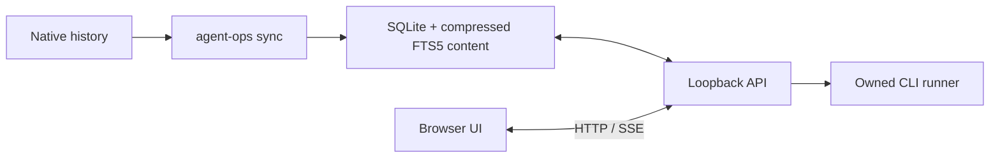

# my-agent-ops

Codex, Claude Code, Kiro CLI의 대화 이력과 실행 작업을 한곳에서 관리하는
로컬 운영 도구입니다. 브라우저에서 세션을 찾고, 작업을 실행하고, 다음
에이전트에 맥락을 인계할 수 있습니다.

앱 표시 제목은 **my-agent-ops**이며 설치 패키지명은 `agent-ops-local`,
터미널 실행 명령은 `agent-ops`입니다.

대화 데이터는 로컬 SQLite에 저장합니다. 별도 계정, 호스팅 서버, 텔레메트리는
없습니다. 실제 에이전트 실행에는 사용자가 설치한 CLI와 해당 CLI의 인증을
사용합니다.

## 시작하기

소스 설치에는 Git, Node.js **20.19 이상**, npm이 필요합니다.

```bash
git clone https://github.com/whchoi98/agent-ops.git
cd agent-ops
npm ci
npm run build
npm start
```

브라우저에서 `http://127.0.0.1:4317`을 엽니다. 기본 데이터 디렉터리는
`~/.local/share/agent-ops`이며 `XDG_DATA_HOME` 또는 `AGENT_OPS_DATA_DIR`로
변경할 수 있습니다.

macOS 설치와 기록 경로는 [온보딩](docs/onboarding.md#macos-korean)에,
시작·진단·업데이트·최적화 절차는 [운영 런북](docs/runbooks/local-operations.md)에
정리했습니다. Mac에서 실행한 앱은 해당 Mac의 기록을 수집합니다.

CloudFront → ALB → EC2의 **인증된 code-server 포트 프록시**로 접속한다면
외부 URL을 지정합니다. 도메인은 실제 사용하는 주소로 바꾸세요.

```bash
npm start -- --port 4327 --public-url https://YOUR_DOMAIN/proxy/4327/
```

앱은 계속 `127.0.0.1`에만 바인딩합니다. 지정한 HTTPS 출처와 경로를 사용해
화면·API·실시간 이벤트를 연결하며, 프록시의 기존 로그인은 유지해야 합니다.
서비스 실행 방법은 [운영 가이드](docs/operations.md)에 있습니다.

실제 이력을 읽기 전에 샘플 화면부터 확인하려면:

```bash
npm run demo -- --port 4318
```

데모는 별도 `demo/` 저장소를 사용합니다. 샘플 세션과 실행 기록임을 화면에
표시하며 CLI 실행·재실행은 차단합니다.

배포용 npm 파일을 받은 경우:

```bash
npm install -g ./agent-ops-local-1.1.1.tgz
agent-ops
```

전역 설치 없이 압축 파일로 바로 실행할 수도 있습니다.

```bash
npm exec --package=./agent-ops-local-1.1.1.tgz -- agent-ops demo --port 4318
```

## 사용할 수 있는 기능

| 화면 | 기능 |
|---|---|
| 운영 현황 | 세 에이전트의 이력, 최근 작업, 실행 상태, 30일 활동 |
| 세션 탐색 | 대화 본문 검색, 에이전트·프로젝트·날짜·태그 필터, 북마크, 페이지 탐색 |
| 대화 상세 | Markdown, 도구 출력, 역할 필터, 메모·태그, 세션 비교 |
| 실행 보드 | 새 작업, 명령 미리보기, 대기열, 실시간 로그, 취소, 재실행 |
| 작업 인계 | 선택한 세션의 맥락과 메모를 다른 에이전트용 프롬프트로 준비 |
| 프로젝트 | 작업 경로 등록, 프로젝트별 실행 허용, 이력 탐색 |
| 사용량 | 기록된 토큰·비용, 모델·프로젝트·도구별 분포, 캐시·실행 결과 |
| 프롬프트 | 검토·구현·디버깅·문서화 템플릿과 사용자 템플릿 |
| 스킬·플러그인 | 어시스턴트별 정의·캐시·활성화 설정, 적용 범위, 원문·참조 파일, 도구·MCP·훅 분석 |
| 설정 | CLI 설치 상태·현재/최신 버전 비교, 수집 경로, 동시 실행 수, 시간 제한, 화면 테마 |

`Ctrl/Cmd + K`로 명령 팔레트를 엽니다. 밝은 화면과 어두운 화면을 지원하며,
좁은 화면에서는 모바일 내비게이션을 사용할 수 있습니다.

상단 테마 버튼 옆의 **한/EN** 버튼으로 한국어와 영어를 전환합니다.
선택한 언어는 브라우저에 저장합니다. 대화, 메모, 스킬 원문과 사용자 입력은
번역하지 않으며 화면 언어를 바꿔도 검색 조건과 작성 중인 설정을 유지합니다.

**스킬·플러그인**에서는 Codex, Claude Code, Kiro별 항목을 검색하고 등록된
프로젝트를 선택해 해당 경로의 구성을 확인합니다. 상세 화면은 목적, 호출 조건,
선언된 도구·MCP·훅, 참조 에이전트와 파일을 정리합니다. 설정상 활성 상태와
실제 호출 이력은 구분하며, 캐시만으로 활성화나 사용 횟수를 추정하지 않습니다.

**CLI 분석 작업 준비**는 원문을 포함한 분석 프롬프트를 기존 새 실행 화면에
넣습니다. 내용을 검토하고 명령 미리보기·실행 시작을 선택하기 전에는 CLI를
호출하지 않습니다. 기본 권한은 읽기 전용입니다.

CLI 버전 비교는 설치된 버전과 공식 공개 배포의 최신 버전을 함께 보여줍니다.
업데이트 가능, 동일 버전, 공개 배포보다 높은 버전, 미설치와 확인 실패를
구분하며 확인 시각과 출처를 표시합니다. 최신 정보 조회는 공개 메타데이터만
요청하며 로컬 버전 문자열·설정·대화 내용을 외부로 전송하지 않습니다.

## 실제 프로젝트 실행

1. CLI의 비대화형 실행이 터미널에서 동작하도록 설치와 인증을 준비합니다.
2. **설정**에서 각 CLI의 설치 상태와 수집 경로를 확인하고 **동기화**합니다.
3. **프로젝트**에서 작업할 디렉터리를 등록하거나 가져온 프로젝트의 실행을 켭니다.
4. **새 작업**에서 에이전트, 프로젝트, 권한, 프롬프트를 선택합니다.
5. 명령을 미리 확인한 뒤 실행합니다. 실행 보드에서 로그와 결과를 확인합니다.

가져온 프로젝트는 기본적으로 실행이 꺼져 있습니다. 같은 프로젝트의 작업은
동시에 실행하지 않습니다. 기본 동시 실행 수는 2, 작업 시간 제한은 30분입니다.

대화의 **재개**는 같은 에이전트의 원본 세션을 사용합니다. **작업 인계**는 다른
에이전트가 읽을 수 있는 새 프롬프트를 준비하며, 사용자가 편집하고 실행하기
전에는 에이전트를 시작하지 않습니다.

CLI 설치 확인은 인증 확인이 아닙니다. 모델 이름을 비워 두면 각 CLI 설정의
기본 모델을 사용합니다. CLI 버전이나 인증 방식에 따른 실패는 실행 로그에서
확인할 수 있습니다.

## 구성 개요



세션 수집과 CLI 실행은 분리되어 있습니다. 전체 구성은
[아키텍처](docs/architecture.md), 선택한 방식과 제약은
[설계 결정](docs/decisions/README.md)을 참고하세요.

| 환경 변수 | 기본값·역할 |
|---|---|
| `AGENT_OPS_DATA_DIR` | 앱 데이터 경로. 미설정 시 `XDG_DATA_HOME/agent-ops` 또는 `~/.local/share/agent-ops` |
| `AGENT_OPS_PORT` | 루프백 포트, 기본 `4317` |
| `AGENT_OPS_PUBLIC_URL` | 인증된 로컬 프록시의 외부 HTTPS URL, 기본 미설정 |
| `XDG_DATA_HOME` | 앱·Kiro CLI 데이터의 기본 기준 경로 |
| `CODEX_HOME` | Codex 기준 경로, 기본 `~/.codex` |
| `CLAUDE_CONFIG_DIR` | Claude Code 기준 경로, 기본 `~/.claude` |

CLI의 `--data-dir`, `--port`, `--public-url`을 지정하면 해당 환경 변수보다
우선합니다. 데모는 선택한 데이터 기준 경로의 `demo/` 하위 디렉터리를 사용합니다.

## 명령줄

```bash
agent-ops --help
agent-ops doctor
agent-ops sync
agent-ops optimize # 서버를 종료한 뒤 실행: 백업 + 검색 저장소 압축 + 공간 회수
agent-ops list --agent codex --query "배포" --limit 20
agent-ops list --json
agent-ops export SESSION_ID --format md --out session.md
agent-ops serve --port 4317 --data-dir /absolute/path/to/data
```

내보내기는 JSON, Markdown, 독립 HTML을 지원합니다. 일반적인 비밀키 패턴을
마스킹하며 기존 출력 파일을 자동으로 덮어쓰지 않습니다.

## 수집과 사용량

| 에이전트 | 기본 수집 위치 |
|---|---|
| Codex | `$CODEX_HOME/sessions`, `$CODEX_HOME/archived_sessions` 또는 `~/.codex` 아래 동일 경로 |
| Claude Code | `$CLAUDE_CONFIG_DIR/projects` 또는 `~/.claude/projects` |
| Kiro CLI | `~/.kiro/sessions/cli`, `~/.local/share/kiro-cli/data.sqlite3` |

Kiro의 macOS 저장소도 기본 경로에 포함됩니다. 다른 경로는 설정에서 추가할 수
있습니다. 원본 파일과 원본 SQLite는 읽기 전용으로 접근합니다. 잘못된 파일과
지원하지 않는 기록은 동기화 진단에 표시하고 나머지 수집을 계속합니다.

토큰은 **기록된 값만** 집계합니다. 입력 토큰은 캐시 읽기·쓰기 입력을 포함하는
기준으로 정규화합니다. 기록되지 않은 비용은 `—`이며 0달러로 추정하지
않습니다. 비용 합계는 비용 기록이 있는 세션의 부분 합계로, 청구서가 아닙니다.
도구 실행 시간과 세션 기록 시간도 실제 CPU 사용 시간으로 해석하지 않습니다.

## 개발과 검증

```bash
npm run dev                 # API + Vite, 로컬 .data 사용
npm run dev -- --demo       # 샘플 데이터로 UI 개발
npm run typecheck
npm test
npm run build
npm run test:e2e
npm pack                   # 설치 가능한 npm 배포 파일
```

브라우저 테스트에는 Playwright Chromium이 필요합니다.

```bash
npx playwright install chromium
```

테스트는 임시 저장소와 제어 가능한 로컬 실행 파일을 사용합니다. 모델을
호출하거나 실제 프로젝트를 수정하지 않습니다. 브라우저 테스트는 별도
데모 저장소와 포트 4329를 사용합니다.

아키텍처와 운영 세부 사항은 [설계](docs/design.md),
[운영 가이드](docs/operations.md), [API](docs/api.md)에 있습니다.
검증 범위와 결과는 [검증 기록](docs/verification.md)에 정리합니다.
빌드 산출물에는 의존성의 라이선스 원문인 `THIRD_PARTY_NOTICES.txt`가 포함됩니다.
전체 문서는 [문서 목록](docs/README.md), 변경 사항은 [변경 기록](CHANGELOG.md)에서
확인할 수 있습니다.
기여 절차는 [CONTRIBUTING.md](CONTRIBUTING.md), 코드 탐색은
[구현 참조 색인](docs/reference/INDEX.md)을 참고하세요.

## 지원 범위

서버는 `127.0.0.1`에만 바인딩합니다. 원격 머신에서는 인증된 로컬 프록시와
`--public-url` 설정 또는 SSH 포트 포워딩으로 접속합니다. CLI 실행은 해당
CLI가 설치·인증된 서버 머신에서 일어납니다.

my-agent-ops가 시작한 프로세스만 취소할 수 있습니다. 외부 터미널에서 시작한
프로세스를 이력 파일만 보고 실행 중이라고 표시하거나 종료하지 않습니다.
서버를 재시작하면 미완료 작업은 중단됨으로 표시하며 자동 재실행하지 않습니다.

애플리케이션 코드는 MIT 라이선스입니다. 번들 한글 글꼴은 동봉한 OFL 라이선스를 따릅니다.
Kiro·Codex 아이콘은 공식 배포 자산을 로컬에 포함합니다.
[아이콘 출처와 소유권](public/icons/README.md)을 참고하세요.
