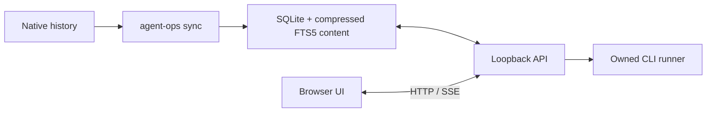

# my-agent-ops

[](LICENSE) [](#testing) [](package.json) [](#english) [](#한국어)

Manage Codex, Claude Code and Kiro CLI conversations and runs locally. / Codex, Claude Code, Kiro CLI의 대화와 실행 작업을 관리하는 로컬 운영 도구입니다.

---

# English

## Overview

my-agent-ops is a local workbench for finding conversations, running jobs and handing context between Codex, Claude Code and Kiro CLI.
It stores imported conversations and workbench state in local SQLite, requires no separate workbench account or hosted backend, and sends no telemetry.
The app title is `my-agent-ops`, the npm package is `agent-ops-local`, and the terminal command is `agent-ops`.

## Features

- **Search and organize** - Import native history, search full conversations, filter sessions, add notes and tags, compare sessions and export results.
- **Control execution** - Preview CLI commands, queue jobs, follow live logs, cancel owned work and prepare editable handoffs.
- **Inspect assistant configuration** - Browse skills, plugins, Powers and MCP declarations with source evidence, redacted previews and explicit analysis or connection checks.
- **Monitor resources and versions** - View app CPU/RSS and storage, compare installed/latest CLI versions and inspect supported macOS app metadata on the server host.
- **Use either language** - Switch between Korean and English, keep original content, choose light/dark themes and explore an isolated demo on desktop or mobile.

## Prerequisites

- Install Node.js **20.19.0 or later** and npm. The project declares no separate minimum npm version.
- Install Git for a source checkout. No minimum Git version is declared.
- Install and authenticate the relevant `codex`, `claude` or `kiro-cli` on the server host before running assistant jobs. History import and demo browsing do not require model execution.

## Installation

| Your situation | Follow this guide |
|---|---|
| First installation on a Mac | [macOS quick start](#macos-quick-start) |
| Already installed with `npm install -g` | [macOS upgrade (npm)](#macos-upgrade-npm) |
| Already installed with `git clone` | [Upgrade a source checkout](#upgrade-a-source-checkout) |

### macOS quick start

Use a supported [Node.js LTS release](https://nodejs.org/en/download) that meets the prerequisites above.
If Node.js and npm are already installed, use that installation; otherwise follow the [official installation guide](https://docs.npmjs.com/downloading-and-installing-node-js-and-npm).
Open **Terminal** on the Mac and run:

```bash
# Check that Node.js and npm are available.
node --version
npm --version

# Install my-agent-ops 1.2.0 from the GitHub release.
npm install -g https://github.com/whchoi98/agent-ops/releases/download/v1.2.0/agent-ops-local-1.2.0.tgz

# Confirm the installed version.
agent-ops --version
# 1.2.0

# Start the app.
agent-ops
```

Open **`http://127.0.0.1:4317`** in a browser. Keep the terminal open while using the app and press `Ctrl+C` to stop it.
The Mac installation reads that Mac's history and app metadata.
If npm reports `EACCES`, follow the [official npm permissions guide](https://docs.npmjs.com/resolving-eacces-permissions-errors-when-installing-packages-globally).

### macOS upgrade (npm)

Use this method if you previously installed an archive with `npm install -g`.
Wait for active jobs and synchronization to finish, then press **`Ctrl+C` in the terminal running the app**.
Run:

```bash
# Install version 1.2.0 over the existing npm installation.
npm install -g https://github.com/whchoi98/agent-ops/releases/download/v1.2.0/agent-ops-local-1.2.0.tgz

# Confirm the new version.
agent-ops --version
# 1.2.0

# Restart the app.
agent-ops
```

Reload the browser after the server starts.
Reuse the data-directory environment variables and startup options you used before, including a custom `--data-dir`, `--port` or `--public-url`.
The app continues to use your existing conversations and settings in the same data directory; the default is `~/.local/share/agent-ops`.
Use the archive URL for the desired version from [GitHub Releases](https://github.com/whchoi98/agent-ops/releases) for future upgrades.

### Source checkout

```bash
# Clone the repository.
git clone https://github.com/whchoi98/agent-ops.git
cd agent-ops

# Install locked dependencies and build the app.
npm ci
npm run build

# Start the local server.
npm start
```

Open `http://127.0.0.1:4317`. Keep the terminal open; stop the server with `Ctrl+C`.
Data defaults to `~/.local/share/agent-ops`; see [Configuration](#configuration) for overrides.
For installation on a Mac, read [onboarding](docs/onboarding.md); that server reads the Mac's own history and uses its installed CLIs.
Use the [local operations runbook](docs/runbooks/local-operations.md) for startup, diagnostics, updates and recovery.

### Upgrade a source checkout

Use this method if you installed with `git clone`.
Wait for active jobs and synchronization to finish, then stop the app with `Ctrl+C`.
Open a terminal in your existing `agent-ops` repository and run:

```bash
# Download the latest source from the tracked branch.
git pull --ff-only

# Install locked dependencies and rebuild the app.
npm ci
npm run build

# Confirm the version of this source checkout.
node dist/server/index.js --version

# Restart the server.
npm start
```

Reuse your previous data-directory settings and startup options, then reload the browser.

### Isolated demo

```bash
# Browse sample data before importing native history.
npm run demo -- --port 4318
```

Open `http://127.0.0.1:4318`. Demo data lives in `demo/` under the selected data directory.
The UI labels sample sessions and runs; assistant execution, retries and MCP connection checks are disabled.

### Local npm archive

After installing dependencies in a source checkout, create an archive with `npm pack`, or download the [v1.2.0 installation archive](https://github.com/whchoi98/agent-ops/releases/download/v1.2.0/agent-ops-local-1.2.0.tgz).
Use version `1.2.0` from the [source manifest](package.json) and [GitHub release](https://github.com/whchoi98/agent-ops/releases/tag/v1.2.0); read [CHANGELOG.md](CHANGELOG.md) for release changes and upcoming work.
These commands install a local file and do not depend on a public npm release.

```bash
# Build and create the local installation archive.
npm pack

# Install the archive and start the app.
npm install -g ./agent-ops-local-1.2.0.tgz
agent-ops
```

To run the archive without a global installation:

```bash
# Start the archive in demo mode.
npm exec --package=./agent-ops-local-1.2.0.tgz -- agent-ops demo --port 4318
```

The archive includes the built application and public documentation.

## Usage

### Workspaces and navigation

| Workspace | Use |
|---|---|
| Overview | View assistant history, recent jobs, execution status and 30-day activity |
| Sessions | Search conversation text and filter by assistant, project, date, tag or bookmark, with pagination |
| Conversation details | Read Markdown and tool output, filter roles, edit notes/tags and compare sessions |
| Runs | Create jobs, preview commands, inspect the queue and live logs, cancel or retry |
| Handoff | Prepare a prompt from a session's context and notes for another assistant |
| Projects | Register working directories, enable execution per project and browse related history |
| Analytics | Inspect recorded tokens/costs, model/project/tool distributions, cache usage and run outcomes |
| Templates | Use review, implementation, debugging and documentation prompts, or save your own |
| Skills & plugins | Inspect definitions, cached installs, activation evidence, scope, source/reference files and declared tools/MCP/hooks |
| Resources | Inspect server and owned-work CPU/RSS, recent trends, data files and filesystem availability |
| MCP | Inspect client-specific declarations and run previewed metadata checks |
| Settings | Check CLI versions and macOS app metadata; configure history roots, concurrency, timeouts and theme |

Open the command palette with `Ctrl/Cmd + K`. Use light/dark themes and mobile navigation on narrow screens.
The **한/EN** control beside the theme button switches languages and saves the choice in the browser.
Conversations, notes, skill source and user input remain unchanged; switching languages preserves filters and settings drafts.

### Run a project

1. Prepare the CLI's non-interactive installation and authentication in the server terminal.
2. Open **Settings**, check CLI detection and history paths, then sync.
3. Register a working directory in **Projects**, or enable execution for an imported project.
4. Create a run and choose the assistant, project, permissions and prompt.
5. Review the command preview, start the run and follow its logs and result.

Imported projects default to execution disabled. Jobs for the same real project path run sequentially.
The defaults are **2** concurrent jobs and a **30-minute** timeout.
Read-only and workspace-write permissions follow each CLI's capabilities; they do not all provide the same OS isolation.
For Claude/Kiro workspace-write jobs, **Allow terminal commands** is a separate option that defaults to off; inspect its effect in the preview.

CLI detection does not verify authentication. Leave the model field empty to use the CLI's configured default.
Execution uses the server host's CLI and authentication; inspect run logs for version or authentication errors.
**Resume** uses the same assistant's original session. **Handoff** prepares an editable prompt for another assistant and waits for an explicit run.

Only processes started and owned by my-agent-ops can be cancelled.
The app does not infer that an external terminal process is running from history files or stop that process.
After a server restart, incomplete jobs are marked interrupted and are not automatically rerun.

### Command line and maintenance

Use `agent-ops` after installing the archive. From a built source checkout, replace it with `node dist/server/index.js`.

```bash
# Inspect commands and local diagnostics, then import history.
agent-ops --help
agent-ops doctor
agent-ops sync

# Search sessions or list them as JSON.
agent-ops list --agent codex --query "deploy" --limit 20
agent-ops list --json

# Paste a session ID from the list, press Enter, then export it.
read -r agent_ops_session_id
agent-ops export "$agent_ops_session_id" --format md --out session.md
```

Exports support `json`, `md` and standalone `html`. They mask common secret patterns and refuse to overwrite an existing output file.
Review exports before sharing; redaction cannot identify every secret format.

Stop the server and any separate sync using the same store before optimizing:

```bash
# Back up and verify the cache, compress search content and reclaim unused pages.
agent-ops optimize
```

Optimization preserves conversations, notes, tags and bookmarks, and leaves native history unchanged.
It verifies a compressed backup before mutation. Existing large search indexes are converted through this offline command, not during HTTP startup.
Read the [operations guide](docs/operations.md) for backup and restore procedures.

### History and recorded usage

| Assistant | Default history sources |
|---|---|
| Codex | `$CODEX_HOME/sessions`, `$CODEX_HOME/archived_sessions`; `CODEX_HOME` defaults to `~/.codex` |
| Claude Code | `$CLAUDE_CONFIG_DIR/projects`; `CLAUDE_CONFIG_DIR` defaults to `~/.claude` |
| Kiro CLI | `~/.kiro/sessions/cli`, `$XDG_DATA_HOME/kiro-cli/data.sqlite3` (default `~/.local/share/kiro-cli/data.sqlite3`); macOS also includes `~/Library/Application Support/kiro-cli/data.sqlite3` |

Add other roots in Settings. Native files and SQLite databases are read-only.
Malformed files and unsupported records appear in sync diagnostics while other imports continue.

Usage totals include **recorded values only**. Input tokens are normalized to include cache-read and cache-write input.
Missing token and cost records remain marked as unknown.
Cost totals are partial sums of sessions with cost records, not invoices.
Tool duration and session timestamps do not measure CPU usage; use Resources for OS measurements.

### Skills, plugins and Powers

Select an assistant and a registered project in **Skills & plugins** to inspect that scope.
Details show purpose, invocation conditions, declared tools/MCP/hooks, referenced agents and files, with redacted source previews and local content analysis.
Activation status reflects configuration evidence; cached files do not prove activation, invocation or usage counts.

**Prepare CLI analysis** places an editable prompt, including source content, into the existing new-run form.
Review it and explicitly preview/start the run before any CLI is called. The default permission is read-only.

### Resources

Open **Analytics and management → Resources** to view CPU/RSS for the server and owned sync, run and MCP processes.
CPU/memory sampling runs every **5 seconds**; at most **180 samples**, about **15 minutes**, remain in RAM and disappear on restart.
HTTP MCP checks are included in the server process.

Disk metadata refreshes every **60 seconds**. The view separates DB, WAL/SHM, backups and other app-data files from filesystem free space.
The app-data total excludes installation dependencies and native assistant archives.
Collection uses OS counters and file metadata without querying SQLite or reading transcript contents.
`GET /api/resources` returns a cached report and starts no scan, process query, SQL query or archive/SSE refresh.
Browser polling stops when the page is hidden, closed or paused.

CPU at **100%** means one logical core; it can exceed that value. Unknown, stale and partial readings stay identified.
Read [resource monitoring](docs/reference/resources.md) for RSS accounting, bounded scans and collection costs.

### MCP

Open **Analytics and management → MCP**, select an assistant and registered project, and inspect client-specific declarations, masked configuration and diagnostics.
Source and client provenance distinguish Claude Code CLI, Desktop Code and Desktop Chat, as well as Codex and Kiro clients.
Declarations and timestamped checks do not establish another client's current connection state.

Request a preview, review its program or endpoint, then explicitly start the check.
Checks use initialization and metadata methods such as `tools/list`, `resources/list` and `prompts/list`; they do not invoke tools, read resource content, execute prompts or request model inference.
There are no automatic probes or native configuration edits.

A stdio check starts the configured program, whose startup can have side effects; an HTTP check can send configured authentication to the selected endpoint.
With a project selected, execution permission is required. Checks allow one active probe with a default **10-second** protocol deadline and bounded output/cleanup.
Cancellation stops only owned probe work, and demo checks are disabled.
Read the [MCP reference](docs/reference/mcp.md) for transports, client precedence, redaction and unsupported authentication mechanisms.

### CLI and desktop versions

In **Settings**, compare installed CLI versions with the latest official public metadata.
The UI distinguishes updates, matching versions, versions ahead of the public channel, missing installations and lookup failures, with check times and sources.
Latest-version requests send no local version strings, settings or conversations; checking does not update a CLI.

On macOS, **Settings → macOS desktop apps** reads version, build and path information from `Info.plist` for Codex App, Claude Desktop and Kiro IDE.
It checks `Codex.app`, `Claude.app` and `Kiro.app` under `/Applications` and `~/Applications`: **6** fixed candidates, cached for up to **10 minutes**.
The Claude value is the app/container version including the Code tab; CLI and internal Code engine versions remain separate.
Desktop latest versions are not inferred from CLI releases.

This inventory describes the **server host**. An EC2 server cannot inspect the browser user's Mac.
Other hosts return `unsupported-host` with `installed: null`, which does not mean the user's apps are absent.
CLI conversation import remains separate; this inventory does not import complete private or cloud desktop histories.
Read [desktop app support](docs/reference/desktop-apps.md) for metadata sources, candidate limits and Mac validation limits.

### Authenticated proxy and SSH access

For **CloudFront → ALB → EC2 → code-server**, enter the full browser-facing HTTPS URL, including `/proxy/4327/`:

```bash
# Paste the HTTPS URL for your authenticated proxy, then press Enter.
read -r agent_ops_public_url
npm start -- --port 4327 --public-url "$agent_ops_public_url"
```

Keep the proxy's existing login enabled. The server still binds only to `127.0.0.1`.
The explicit URL supplies the permitted origin and path for the UI, API, fonts and SSE; it does not add public Internet authentication.
Host, Origin, local-peer and mutation-header guards remain in place.
For persistent service operation, customize the user and paths in [the systemd example](deploy/agent-ops.service) and follow [operations](docs/operations.md).

Alternatively, start the server on the remote host and forward its port from a local terminal:

```bash
# Enter your SSH destination, then press Enter.
read -r agent_ops_ssh_target
ssh -N -L 4317:127.0.0.1:4317 "$agent_ops_ssh_target"
```

Open `http://127.0.0.1:4317` locally. CLI execution and project paths still belong to the remote server.

## Configuration

| Name | Description | Default |
|---|---|---|
| `AGENT_OPS_DATA_DIR` | Base directory for app state | `${XDG_DATA_HOME:-$HOME/.local/share}/agent-ops` |
| `AGENT_OPS_PORT` | Loopback HTTP port | `4317` |
| `AGENT_OPS_PUBLIC_URL` | External HTTPS URL behind an authenticated local proxy | `-` |
| `XDG_DATA_HOME` | Default base for app and Kiro CLI data | `~/.local/share` |
| `CODEX_HOME` | Codex configuration/history base | `~/.codex` |
| `CLAUDE_CONFIG_DIR` | Claude Code configuration/history base | `~/.claude` |

`-` means unset. CLI flags `--data-dir`, `--port` and `--public-url` override the matching environment variables.
Demo adds `demo/` to the selected base. Development uses `.data`, or `.data/demo` with `--demo`.
Settings also controls history roots, the **2**-job concurrency default, the **30-minute** timeout and the **60-second** history scan interval.

```bash
# Start with an explicit port and data directory.
agent-ops serve --port 4317 --data-dir "$HOME/.local/share/agent-ops"
```

## Project Structure

The TypeScript server uses Fastify, the browser UI uses React, and SQLite provides persistence and FTS5 search.
Selected source paths:

```text
agent-ops/
├── server/
│   ├── index.ts           # CLI, process lock and HTTP startup
│   ├── app.ts             # API, static UI and SSE
│   ├── store.ts           # SQLite persistence and search
│   ├── background-sync.ts # Owned history import process
│   ├── runner.ts          # Owned CLI job queue
│   ├── maintenance.ts     # Offline backup and compaction
│   ├── providers/         # Read-only native history parsers
│   ├── extensions/        # Skills, plugins and Powers
│   ├── resources/         # CPU/RSS and disk metadata
│   ├── mcp/               # Declarations and explicit checks
│   ├── desktop-apps.ts    # Cached desktop inventory API
│   └── desktop-apps/      # Bounded bundle/plist readers
├── src/
│   ├── features/          # Feature views and state
│   ├── pages/             # React workspaces
│   └── i18n/              # Korean and English interface text
├── shared/                # API and persistence contracts
├── scripts/               # Development and build helpers
├── tests/
│   └── e2e/               # Playwright browser workflows
├── docs/                  # Setup, architecture and operations
├── deploy/
│   └── agent-ops.service  # Example systemd service
├── public/                # Local fonts and vendor icons
└── package.json           # Package metadata and npm scripts
```

History parsing and CLI execution are separate:



Read the [architecture](docs/architecture.md), [design](docs/design.md), [decisions](docs/decisions/README.md) and [implementation reference index](docs/reference/INDEX.md).
Use the [documentation index](docs/README.md) to find all public guides.

## Testing

```bash
# Develop with isolated sample data.
npm run dev -- --demo

# Or develop with native history in .data.
npm run dev
```

For application changes, run the declared checks and affected browser workflows:

```bash
# Run type checks, unit/integration tests and the production build.
npm run check

# Install Chromium if needed, then run the browser suite.
npx playwright install chromium
npm run test:e2e

# Run one unit test file.
npm test -- tests/commands.test.ts

# Run one browser workflow after building.
npm run test:e2e -- tests/e2e/resources.spec.ts
```

Run `npm run typecheck`, `npm test` or `npm run build` separately when needed.
Tests use temporary stores and controlled local CLI fixtures without paid model inference or changes to real projects.
Playwright uses isolated demo data under `.data/e2e/` and port `4329`; it requires a built app and Chromium.

CI workflows and coverage reports are **not configured**. No coverage script or coverage provider is installed.
For documentation-only edits, check links and command accuracy and run `git diff --check`.
Record actual checks and their limits in [verification](docs/verification.md); available commands do not establish a passing result.

## API Documentation

Read [the API contract](docs/api.md) for routes, request/response types, pagination, SSE and access rules.
The base is same-origin `/api`; a configured proxy prefix also applies to API requests.
JSON mutations require `Content-Type: application/json` and `X-Agent-Ops: 1`.
Shared contracts live in `shared/`.

```bash
# Read the running local server's health and cached resource report.
curl --fail --silent --show-error http://127.0.0.1:4317/api/health
curl --fail --silent --show-error http://127.0.0.1:4317/api/resources
```

## Contributing

Read [AGENTS.md](AGENTS.md) and [CONTRIBUTING.md](CONTRIBUTING.md), then:

1. **Fork** [the repository](https://github.com/whchoi98/agent-ops) and work in your fork's checkout.
2. **Branch** with `git switch -c docs/clarify-setup`.
3. **Commit** focused changes using Conventional Commits, for example `git commit -m "docs: clarify setup steps"` or the subject `fix: preserve unknown usage`.
4. **Push** to your fork with `git push -u origin docs/clarify-setup`.
5. **Open a PR** against the original repository, explaining the change, checks performed and remaining limits.

Keep English and Korean facts aligned, preserve existing changelog history, and update the relevant guides and both Unreleased sections.
Keep application data, credentials, exports, dependencies and generated artifacts out of Git.
Use only demo data in screenshots and record performed checks in [verification](docs/verification.md).

## License

Application code uses the [MIT License](LICENSE).
Built distributions include dependency license texts in `THIRD_PARTY_NOTICES.txt`; bundled Korean fonts use their included OFL license.
Kiro and Codex icons are official vendor assets included locally; read [icon sources and ownership](public/icons/README.md).

## Contact

- Maintainer: [whchoi98](https://github.com/whchoi98)
- Issues: [GitHub Issues](https://github.com/whchoi98/agent-ops/issues)
- Email: [whchoi98@gmail.com](mailto:whchoi98@gmail.com)

---

# 한국어

<a id="korean"></a>

## 개요

my-agent-ops는 Codex, Claude Code, Kiro CLI의 대화를 찾고 작업을 실행하며 에이전트 사이에 맥락을 인계하는 로컬 운영 도구입니다.
가져온 대화와 앱 상태를 로컬 SQLite에 저장하며 별도 앱 계정이나 호스팅 백엔드, 텔레메트리 없이 동작합니다.
앱 표시 제목은 `my-agent-ops`, npm 패키지명은 `agent-ops-local`, 터미널 명령은 `agent-ops`입니다.

## 주요 기능

- **검색과 정리** - 원본 이력을 가져와 전체 대화를 검색하고 세션 필터, 메모, 태그, 세션 비교와 내보내기를 사용합니다.
- **실행 제어** - CLI 명령을 미리 보고 작업을 대기열에 넣으며 실시간 로그 확인, 소유 작업 취소와 편집 가능한 작업 인계를 지원합니다.
- **어시스턴트 설정 확인** - 출처 근거와 마스킹된 미리보기로 스킬, 플러그인, Power, MCP 선언을 살펴보고 분석이나 연결 점검을 직접 선택합니다.
- **자원과 버전 확인** - 앱의 CPU, RSS와 저장 공간, CLI 현재, 최신 버전, 서버 호스트의 지원 대상 macOS 앱 정보를 확인합니다.
- **한국어와 영어 사용** - 원문을 보존하며 언어와 밝은 테마, 어두운 테마를 바꾸고 데스크톱이나 모바일에서 격리된 데모를 살펴봅니다.

## 사전 요구 사항

- Node.js **20.19.0 이상**과 npm을 설치하세요. 별도의 npm 최소 버전은 지정하지 않습니다.
- 소스 체크아웃에는 Git이 필요합니다. Git 최소 버전은 지정하지 않습니다.
- 에이전트 작업을 실행하기 전에 서버 호스트에 해당 `codex`, `claude`, `kiro-cli`를 설치하고 인증하세요. 이력 수집과 데모 탐색에는 모델 실행이 필요하지 않습니다.

<a id="시작하기"></a>

## 설치 방법

| 현재 상황 | 따라 할 안내 |
|---|---|
| Mac에 처음 설치합니다 | [macOS 처음 설치](#macos-처음-설치) |
| `npm install -g`로 설치했습니다 | [macOS 업그레이드 (npm)](#macos-업그레이드-npm) |
| `git clone`으로 설치했습니다 | [소스 체크아웃 업그레이드](#소스-체크아웃-업그레이드) |

### macOS 처음 설치

위 사전 요구 사항에 맞는 [Node.js LTS 버전](https://nodejs.org/en/download)을 사용합니다.
Node.js와 npm이 이미 설치되어 있으면 그대로 사용하고 없다면 [공식 설치 안내](https://docs.npmjs.com/downloading-and-installing-node-js-and-npm)에 따라 설치합니다.
Mac의 **터미널**을 열고 다음 명령을 실행합니다.

```bash
# Node.js와 npm이 설치되어 있는지 확인합니다.
node --version
npm --version

# GitHub 릴리스에서 my-agent-ops 1.2.0을 설치합니다.
npm install -g https://github.com/whchoi98/agent-ops/releases/download/v1.2.0/agent-ops-local-1.2.0.tgz

# 설치한 버전을 확인합니다.
agent-ops --version
# 1.2.0

# 앱을 시작합니다.
agent-ops
```

브라우저에서 **`http://127.0.0.1:4317`**에 접속합니다. 앱을 사용하는 동안 터미널을 열어 두고 종료할 때는 `Ctrl+C`를 누릅니다.
Mac에서 실행한 앱은 해당 Mac의 이력과 앱 정보를 읽습니다.
npm에서 `EACCES` 오류가 발생하면 [공식 npm 권한 설정 안내](https://docs.npmjs.com/resolving-eacces-permissions-errors-when-installing-packages-globally)에 따라 해결합니다.

### macOS 업그레이드 (npm)

이전에 `npm install -g`로 압축 파일을 설치했다면 이 방법을 사용합니다.
실행 중인 작업과 동기화가 끝나면 **앱을 실행 중인 터미널에서 `Ctrl+C`를 눌러 종료**합니다.
다음 명령으로 업데이트합니다.

```bash
# 기존 npm 설치본을 1.2.0으로 업데이트합니다.
npm install -g https://github.com/whchoi98/agent-ops/releases/download/v1.2.0/agent-ops-local-1.2.0.tgz

# 새 버전을 확인합니다.
agent-ops --version
# 1.2.0

# 앱을 다시 시작합니다.
agent-ops
```

서버가 시작되면 브라우저를 새로고침합니다.
데이터 경로를 지정하는 환경 변수와 `--data-dir`, `--port`, `--public-url` 등 기존 실행 옵션을 동일하게 사용합니다.
기존 대화와 설정은 같은 데이터 디렉터리에서 계속 사용하며 기본 경로는 `~/.local/share/agent-ops`입니다.
다음 버전으로 업데이트할 때는 [GitHub Releases](https://github.com/whchoi98/agent-ops/releases)에서 원하는 버전의 압축 파일 URL을 사용합니다.

### 소스 체크아웃

```bash
# 저장소를 복제합니다.
git clone https://github.com/whchoi98/agent-ops.git
cd agent-ops

# 잠금 파일에 맞춰 의존성을 설치하고 앱을 빌드합니다.
npm ci
npm run build

# 로컬 서버를 시작합니다.
npm start
```

`http://127.0.0.1:4317`을 여세요. 터미널을 열어 두고 종료할 때는 `Ctrl+C`를 누릅니다.
기본 데이터 경로는 `~/.local/share/agent-ops`이며 변경 방법은 [환경 설정](#환경-설정)에 있습니다.
Mac 설치는 [온보딩](docs/onboarding.md)을 참고하세요. 해당 서버는 Mac의 이력과 설치된 CLI를 사용합니다.
시작, 진단, 업데이트, 복구 절차는 [로컬 운영 런북](docs/runbooks/local-operations.md)을 확인하세요.

### 소스 체크아웃 업그레이드

`git clone`으로 설치했다면 이 방법을 사용합니다.
실행 중인 작업과 동기화가 끝나면 `Ctrl+C`로 앱을 종료합니다.
터미널에서 기존 `agent-ops` 저장소 폴더로 이동한 뒤 다음 명령을 실행합니다.

```bash
# 현재 추적 중인 브랜치의 최신 소스를 가져옵니다.
git pull --ff-only

# 잠금 파일에 맞춰 의존성을 설치하고 다시 빌드합니다.
npm ci
npm run build

# 현재 소스의 버전을 확인합니다.
node dist/server/index.js --version

# 서버를 다시 시작합니다.
npm start
```

기존 데이터 경로 설정과 실행 옵션을 동일하게 사용하고 브라우저를 새로고침합니다.

### 격리된 데모

```bash
# 원본 이력을 가져오기 전에 샘플 데이터를 확인합니다.
npm run demo -- --port 4318
```

`http://127.0.0.1:4318`을 여세요. 데모 데이터는 선택한 데이터 디렉터리 아래 `demo/`에 저장합니다.
샘플 세션과 실행 기록임을 화면에 표시하며 에이전트 실행, 재실행과 MCP 연결 점검은 차단합니다.

### 로컬 npm 압축 파일

소스 체크아웃에서 의존성을 설치한 뒤 `npm pack`으로 압축 파일을 만들거나 [v1.2.0 설치 압축 파일](https://github.com/whchoi98/agent-ops/releases/download/v1.2.0/agent-ops-local-1.2.0.tgz)을 내려받습니다.
[소스 매니페스트](package.json)와 [GitHub 릴리스](https://github.com/whchoi98/agent-ops/releases/tag/v1.2.0)의 버전은 `1.2.0`이며 릴리스 변경 사항과 다음 버전의 작업은 [CHANGELOG.md](CHANGELOG.md)에서 확인합니다.
아래 명령은 로컬 파일을 설치하므로 npm에 공개된 릴리스가 없어도 사용할 수 있습니다.

```bash
# 빌드 후 로컬 설치용 압축 파일을 만듭니다.
npm pack

# 압축 파일을 설치하고 앱을 시작합니다.
npm install -g ./agent-ops-local-1.2.0.tgz
agent-ops
```

전역 설치 없이 압축 파일을 실행하려면 다음 명령을 사용하세요.

```bash
# 압축 파일을 데모 모드로 실행합니다.
npm exec --package=./agent-ops-local-1.2.0.tgz -- agent-ops demo --port 4318
```

압축 파일에는 빌드된 앱과 공개 문서가 포함됩니다.

## 사용법

<a id="사용할-수-있는-기능"></a>

### 화면과 탐색

| 화면 | 용도 |
|---|---|
| 개요 | 에이전트 이력, 최근 작업, 실행 상태와 30일 활동 확인 |
| 세션 | 대화 본문 검색, 에이전트, 프로젝트, 날짜, 태그, 북마크 필터와 페이지 탐색 |
| 대화 상세 | Markdown, 도구 출력 확인, 역할 필터, 메모, 태그 편집과 세션 비교 |
| 실행 | 작업 생성, 명령 미리보기, 대기열, 실시간 로그 확인, 취소와 재실행 |
| 작업 인계 | 세션의 맥락과 메모를 다른 에이전트용 프롬프트로 준비 |
| 프로젝트 | 작업 경로 등록, 프로젝트별 실행 허용과 관련 이력 탐색 |
| 분석 | 기록된 토큰, 비용, 모델, 프로젝트, 도구별 분포, 캐시 사용량과 실행 결과 확인 |
| 템플릿 | 검토, 구현, 디버깅, 문서화 프롬프트 사용과 사용자 템플릿 저장 |
| 스킬, 플러그인 | 정의, 캐시, 활성화 근거, 적용 범위, 원문, 참조 파일과 선언된 도구, MCP, 훅 확인 |
| 자원 | 서버와 소유 작업의 CPU, RSS, 최근 추이, 데이터 파일과 파일시스템 여유 공간 확인 |
| MCP | 클라이언트별 선언 확인과 미리보기 후 메타데이터 점검 |
| 설정 | CLI 버전, macOS 앱 정보 확인, 이력 경로, 동시 실행 수, 시간 제한, 테마 설정 |

`Ctrl/Cmd + K`로 명령 팔레트를 여세요. 밝은 테마, 어두운 테마를 지원하며 좁은 화면에서는 모바일 탐색 메뉴를 사용합니다.
테마 버튼 옆의 **한/EN**으로 언어를 전환하면 선택한 언어를 브라우저에 저장합니다.
대화, 메모, 스킬 원문, 사용자 입력은 바꾸지 않습니다. 언어를 전환해도 필터와 작성 중인 설정을 보존합니다.

<a id="실제-프로젝트-실행"></a>

### 프로젝트 실행

1. 서버 터미널에서 CLI의 비대화형 실행에 필요한 설치와 인증을 준비하세요.
2. **설정**에서 CLI 설치 상태와 이력 경로를 확인한 뒤 동기화하세요.
3. **프로젝트**에서 작업 경로를 등록하거나 가져온 프로젝트의 실행을 켜세요.
4. 새 작업에서 에이전트, 프로젝트, 권한과 프롬프트를 선택하세요.
5. 명령 미리보기를 확인하고 작업을 시작한 뒤 로그와 결과를 살펴보세요.

가져온 프로젝트는 기본적으로 실행이 꺼져 있습니다. 실제 경로가 같은 프로젝트의 작업은 순서대로 실행합니다.
기본 동시 실행 수는 **2**개이며 작업 시간 제한은 **30분**입니다.
읽기 전용, 워크스페이스 쓰기 권한은 각 CLI의 기능을 따르므로 운영체제 격리 수준이 모두 같지는 않습니다.
Claude/Kiro의 워크스페이스 쓰기 작업에서 **터미널 명령 허용**은 별도 옵션이며 기본값은 꺼짐입니다. 미리보기에서 적용할 권한을 확인하세요.

CLI 설치 확인은 인증 확인이 아닙니다. 모델을 비워 두면 CLI에 설정된 기본 모델을 사용합니다.
실행에는 서버 호스트의 CLI와 인증을 사용하며 버전, 인증 오류는 실행 로그에서 확인합니다.
**재개**는 같은 에이전트의 원본 세션을 사용합니다. **작업 인계**는 다른 에이전트용 프롬프트를 편집하도록 준비하고 사용자가 실행할 때까지 기다립니다.

my-agent-ops가 시작하고 소유한 프로세스만 취소할 수 있습니다.
이력 파일만 보고 외부 터미널의 프로세스가 실행 중이라고 판단하거나 해당 프로세스를 종료하지 않습니다.
서버를 재시작하면 미완료 작업은 중단됨으로 표시하며 자동으로 재실행하지 않습니다.

<a id="명령줄"></a>

### 명령줄과 유지보수

압축 파일을 설치한 뒤 `agent-ops`를 사용하세요. 빌드한 소스 체크아웃에서는 `node dist/server/index.js`로 바꿔 실행합니다.

```bash
# 명령과 로컬 진단을 확인한 뒤 이력을 수집합니다.
agent-ops --help
agent-ops doctor
agent-ops sync

# 세션을 검색하거나 JSON 목록을 확인합니다.
agent-ops list --agent codex --query "deploy" --limit 20
agent-ops list --json

# 목록의 세션 ID를 붙여 넣고 Enter를 누른 뒤 내보냅니다.
read -r agent_ops_session_id
agent-ops export "$agent_ops_session_id" --format md --out session.md
```

내보내기는 `json`, `md`, 독립 `html`을 지원합니다. 일반적인 비밀키 패턴을 마스킹하며 기존 출력 파일을 덮어쓰지 않습니다.
모든 비밀 형식을 탐지할 수는 없으므로 공유 전에 내보낸 내용을 확인하세요.

최적화 전에는 같은 저장소를 사용하는 서버와 별도 동기화를 종료하세요.

```bash
# 캐시를 백업, 검증하고 검색 본문을 압축한 뒤 빈 페이지를 회수합니다.
agent-ops optimize
```

최적화는 대화, 메모, 태그, 북마크를 보존하며 원본 이력을 변경하지 않습니다.
변경 전에 압축 백업을 검증합니다. 기존 대규모 검색 색인은 HTTP 시작 시점이 아닌 이 오프라인 명령으로 변환합니다.
백업과 복원 절차는 [운영 가이드](docs/operations.md)를 참고하세요.

<a id="수집과-사용량"></a>

### 이력과 기록된 사용량

| 에이전트 | 기본 이력 경로 |
|---|---|
| Codex | `$CODEX_HOME/sessions`, `$CODEX_HOME/archived_sessions`; `CODEX_HOME` 기본값은 `~/.codex` |
| Claude Code | `$CLAUDE_CONFIG_DIR/projects`; `CLAUDE_CONFIG_DIR` 기본값은 `~/.claude` |
| Kiro CLI | `~/.kiro/sessions/cli`, `$XDG_DATA_HOME/kiro-cli/data.sqlite3`(기본값 `~/.local/share/kiro-cli/data.sqlite3`); macOS에서는 `~/Library/Application Support/kiro-cli/data.sqlite3`도 포함 |

다른 경로는 설정에서 추가하세요. 원본 파일과 SQLite 데이터베이스는 읽기 전용으로 접근합니다.
잘못된 파일과 지원하지 않는 기록은 동기화 진단에 표시하고 나머지 수집을 계속합니다.

사용량은 **기록된 값만** 집계합니다. 입력 토큰은 캐시 읽기, 쓰기 입력을 포함하는 기준으로 정규화합니다.
토큰과 비용 기록이 없으면 미확인 상태로 표시합니다.
비용 합계는 비용 기록이 있는 세션의 부분 합계이며 청구서가 아닙니다.
도구 실행 시간과 세션 기록 시각은 CPU 사용량이 아닙니다. 운영체제 측정값은 자원 화면에서 확인하세요.

### 스킬, 플러그인, Power

**스킬, 플러그인**에서 에이전트와 등록된 프로젝트를 선택해 해당 범위를 확인하세요.
상세 화면에서 목적, 호출 조건, 선언된 도구, MCP, 훅, 참조 에이전트와 파일을 확인합니다. 원문은 마스킹된 미리보기로 읽고 로컬 내용 분석도 살펴보세요.
활성 상태는 설정 근거를 나타내며 캐시 파일만으로 활성화, 호출, 사용 횟수를 입증하지 않습니다.

**CLI 분석 작업 준비**는 원문을 포함한 편집 가능한 프롬프트를 기존 새 작업 화면에 넣습니다.
내용을 검토하고 명시적으로 명령 미리보기, 실행 시작을 선택해야 CLI를 호출합니다. 기본 권한은 읽기 전용입니다.

### 자원

**분석 및 관리 → 자원**에서 서버와 소유 동기화, 실행, MCP 프로세스의 CPU, RSS를 확인하세요.
CPU, 메모리는 **5초**마다 수집하고 최대 **180개**, 약 **15분**의 표본을 RAM에 보관하며 재시작하면 사라집니다.
HTTP MCP 점검은 서버 프로세스에 포함됩니다.

디스크 메타데이터는 **60초**마다 갱신합니다. DB, WAL/SHM, 백업과 기타 앱 데이터 파일을 파일시스템 여유 공간과 구분합니다.
앱 데이터 합계에는 설치 의존성과 원본 에이전트 이력을 포함하지 않습니다.
운영체제 카운터와 파일 메타데이터로 수집하며 SQLite에 쿼리하거나 대화 본문을 읽지 않습니다.
`GET /api/resources`는 캐시 보고서를 반환하며 스캔, 프로세스 조회, SQL 쿼리, 이력/SSE 갱신을 시작하지 않습니다.
화면이 숨겨지거나 닫히거나 일시정지하면 브라우저 조회를 멈춥니다.

CPU **100%**는 논리 코어 하나를 뜻하며 그보다 높을 수 있습니다. 미확인, 오래된 값, 부분 집계 상태를 구분해 표시합니다.
RSS 합산 방식, 탐색 한도와 수집 비용은 [자원 모니터링](docs/reference/resources.md)을 참고하세요.

### MCP

**분석 및 관리 → MCP**에서 에이전트와 등록된 프로젝트를 선택하고 클라이언트별 선언, 마스킹된 설정과 진단을 확인하세요.
출처와 적용 클라이언트 정보는 Claude Code CLI, Desktop Code, Desktop Chat과 Codex, Kiro 클라이언트를 구분합니다.
선언과 시각을 남긴 점검 결과만으로 다른 클라이언트의 현재 연결 상태를 판단하지 마세요.

미리보기를 요청해 프로그램이나 주소를 확인한 뒤 점검을 직접 시작하세요.
점검은 초기화와 `tools/list`, `resources/list`, `prompts/list` 같은 메타데이터 메서드를 사용하며 도구 호출, 리소스 본문 읽기, 프롬프트 실행, 모델 추론은 요청하지 않습니다.
자동 점검이나 원본 설정 파일 수정은 수행하지 않습니다.

stdio 점검은 설정된 프로그램을 시작하므로 시작 과정에서 부수 효과가 생길 수 있으며 HTTP 점검은 선택한 주소에 설정된 인증 정보를 보낼 수 있습니다.
프로젝트를 선택했다면 실행 권한이 필요합니다. 점검은 한 번에 하나만 실행하며 기본 프로토콜 제한 시간은 **10초**이고 출력과 정리 작업에도 한도를 둡니다.
취소는 소유한 점검 작업만 대상으로 하며 데모 점검은 차단합니다.
전송 방식, 클라이언트별 우선순위, 마스킹과 지원하지 않는 인증 방식은 [MCP 참조](docs/reference/mcp.md)를 확인하세요.

### CLI와 데스크톱 버전

**설정**에서 설치된 CLI 버전과 공식 공개 메타데이터의 최신 버전을 비교하세요.
화면은 업데이트 가능, 동일 버전, 공개 채널보다 높은 버전, 미설치, 조회 실패를 구분하고 확인 시각과 출처를 표시합니다.
최신 버전 요청에 로컬 버전 문자열, 설정, 대화를 보내지 않으며 버전 확인으로 CLI를 업데이트하지 않습니다.

macOS의 **설정 → macOS 데스크톱 앱**에서는 `Info.plist`에서 Codex App, Claude Desktop, Kiro IDE의 버전, 빌드, 경로를 읽습니다.
`/Applications`와 `~/Applications` 아래 `Codex.app`, `Claude.app`, `Kiro.app`을 확인하며 고정 후보 **6**곳의 결과를 최대 **10분** 동안 캐시합니다.
Claude의 값은 Code 탭을 포함한 앱/컨테이너 버전이며 CLI, 내부 Code 엔진 버전은 별개입니다.
CLI 릴리스로 데스크톱 최신 버전을 추정하지 않습니다.

이 목록은 **서버 호스트**의 정보입니다. EC2 서버는 브라우저 사용자의 Mac을 검사할 수 없습니다.
다른 호스트에서는 `unsupported-host`와 `installed: null`을 반환하며 사용자 앱이 없다는 뜻은 아닙니다.
CLI 대화 수집은 별도 기능이며 이 목록에서 전체 비공개, 클라우드 데스크톱 이력을 가져오지 않습니다.
메타데이터 출처, 후보 경로의 범위와 Mac 검증 한계는 [데스크톱 앱 지원 범위](docs/reference/desktop-apps.md)를 참고하세요.

<a id="지원-범위"></a>

### 인증된 프록시와 SSH 접속

**CloudFront → ALB → EC2 → code-server**에서는 `/proxy/4327/`를 포함한 전체 브라우저 접속 HTTPS URL을 입력하세요.

```bash
# 인증된 프록시의 HTTPS URL을 붙여 넣고 Enter를 누릅니다.
read -r agent_ops_public_url
npm start -- --port 4327 --public-url "$agent_ops_public_url"
```

프록시의 기존 로그인을 유지하세요. 서버는 계속 `127.0.0.1`에만 바인딩합니다.
지정한 URL은 화면, API, 글꼴, SSE에 허용할 출처와 경로를 정하며 공개 인터넷용 인증을 추가하지 않습니다.
Host, Origin, 로컬 피어, 변경 요청 헤더 검사는 그대로 유지합니다.
서비스로 계속 실행하려면 [systemd 예제](deploy/agent-ops.service)의 사용자와 경로를 수정하고 [운영 가이드](docs/operations.md)를 따르세요.

SSH를 사용하려면 원격 호스트에서 서버를 시작한 뒤 로컬 터미널에서 포트를 전달하세요.

```bash
# SSH 접속 대상을 입력하고 Enter를 누릅니다.
read -r agent_ops_ssh_target
ssh -N -L 4317:127.0.0.1:4317 "$agent_ops_ssh_target"
```

로컬에서 `http://127.0.0.1:4317`을 여세요. CLI 실행과 프로젝트 경로는 원격 서버 기준입니다.

## 환경 설정

| 이름 | 설명 | 기본값 |
|---|---|---|
| `AGENT_OPS_DATA_DIR` | 앱 상태를 저장할 기준 디렉터리 | `${XDG_DATA_HOME:-$HOME/.local/share}/agent-ops` |
| `AGENT_OPS_PORT` | 루프백 HTTP 포트 | `4317` |
| `AGENT_OPS_PUBLIC_URL` | 인증된 로컬 프록시의 외부 HTTPS URL | `-` |
| `XDG_DATA_HOME` | 앱과 Kiro CLI 데이터의 기본 기준 경로 | `~/.local/share` |
| `CODEX_HOME` | Codex 설정, 이력의 기준 경로 | `~/.codex` |
| `CLAUDE_CONFIG_DIR` | Claude Code 설정, 이력의 기준 경로 | `~/.claude` |

`-`는 미설정입니다. CLI의 `--data-dir`, `--port`, `--public-url`은 해당 환경 변수보다 우선합니다.
데모는 선택한 기준 경로에 `demo/`를 추가합니다. 개발 모드에서는 `.data`, `--demo`를 함께 쓰면 `.data/demo`를 사용합니다.
설정에서 이력 경로와 기본 동시 실행 **2**개, 시간 제한 **30분**, 이력 수집 주기 **60초**도 변경합니다.

```bash
# 포트와 데이터 디렉터리를 지정해 시작합니다.
agent-ops serve --port 4317 --data-dir "$HOME/.local/share/agent-ops"
```

<a id="구성-개요"></a>

## 프로젝트 구조

TypeScript 서버는 Fastify, 브라우저 화면은 React를 사용하며 SQLite가 저장과 FTS5 검색을 담당합니다.
주요 소스 경로입니다.

```text
agent-ops/
├── server/
│   ├── index.ts           # CLI, 프로세스 잠금과 HTTP 시작
│   ├── app.ts             # API, 정적 화면과 SSE
│   ├── store.ts           # SQLite 저장과 검색
│   ├── background-sync.ts # 앱이 소유한 이력 수집 프로세스
│   ├── runner.ts          # 앱이 소유한 CLI 작업 대기열
│   ├── maintenance.ts     # 오프라인 백업과 압축
│   ├── providers/         # 읽기 전용 원본 이력 파서
│   ├── extensions/        # 스킬, 플러그인, Power
│   ├── resources/         # CPU, RSS와 디스크 메타데이터
│   ├── mcp/               # 선언과 명시적 점검
│   ├── desktop-apps.ts    # 캐시된 데스크톱 정보 API
│   └── desktop-apps/      # 범위를 제한한 번들, plist 읽기
├── src/
│   ├── features/          # 기능별 화면과 상태
│   ├── pages/             # React 작업 화면
│   └── i18n/              # 한국어, 영어 화면 문구
├── shared/                # API와 저장 계약
├── scripts/               # 개발, 빌드 보조 스크립트
├── tests/
│   └── e2e/               # Playwright 브라우저 동선
├── docs/                  # 설치, 아키텍처, 운영 문서
├── deploy/
│   └── agent-ops.service  # systemd 서비스 예제
├── public/                # 로컬 글꼴과 공급사 아이콘
└── package.json           # 패키지 정보와 npm 명령
```

이력 파싱과 CLI 실행은 분리되어 있습니다.


[아키텍처](docs/architecture.md), [설계](docs/design.md), [설계 결정](docs/decisions/README.md), [구현 참조 색인](docs/reference/INDEX.md)을 참고하세요.
전체 공개 안내서는 [문서 색인](docs/README.md)에서 확인합니다.

<a id="개발과-검증"></a>

## 테스트

```bash
# 격리된 샘플 데이터로 개발합니다.
npm run dev -- --demo

# 원본 이력으로 개발하려면 .data를 사용합니다.
npm run dev
```

앱을 변경할 때는 선언된 검사와 영향을 받는 브라우저 동선을 실행하세요.

```bash
# 타입 검사, 단위, 통합 테스트와 배포 빌드를 실행합니다.
npm run check

# 필요하면 Chromium을 설치한 뒤 브라우저 테스트를 실행합니다.
npx playwright install chromium
npm run test:e2e

# 단위 테스트 파일 하나를 실행합니다.
npm test -- tests/commands.test.ts

# 빌드 후 브라우저 동선 하나를 실행합니다.
npm run test:e2e -- tests/e2e/resources.spec.ts
```

필요하면 `npm run typecheck`, `npm test`, `npm run build`를 개별적으로 실행하세요.
테스트는 임시 저장소와 제어 가능한 로컬 CLI 자료를 사용하며 유료 모델 추론이나 실제 프로젝트 변경은 수행하지 않습니다.
Playwright는 `.data/e2e/`의 격리된 데모 데이터와 포트 `4329`를 사용하며 빌드한 앱과 Chromium이 필요합니다.

CI 워크플로와 커버리지 보고서는 **미구성** 상태입니다. 커버리지 명령이나 제공 패키지는 설치하지 않았습니다.
문서만 바꿀 때는 링크와 명령의 정확성을 확인하고 `git diff --check`를 실행하세요.
실제 검사와 한계는 [검증 기록](docs/verification.md)에 남기며 명령이 있다는 이유만으로 통과했다고 판단하지 않습니다.

## API 문서

경로, 요청, 응답 타입, 페이지 탐색, SSE와 접근 규칙은 [API 계약](docs/api.md)을 참고하세요.
기준 경로는 같은 출처의 `/api`이며 프록시 접두 경로를 설정했다면 API 요청에도 적용합니다.
JSON 변경 요청에는 `Content-Type: application/json`과 `X-Agent-Ops: 1`이 필요합니다.
공유 계약은 `shared/`에 있습니다.

```bash
# 실행 중인 로컬 서버의 상태와 캐시된 자원 보고서를 읽습니다.
curl --fail --silent --show-error http://127.0.0.1:4317/api/health
curl --fail --silent --show-error http://127.0.0.1:4317/api/resources
```

## 기여 방법

[AGENTS.md](AGENTS.md)와 [CONTRIBUTING.md](CONTRIBUTING.md)를 읽고 다음 순서로 진행하세요.

1. **Fork**: [저장소](https://github.com/whchoi98/agent-ops)를 포크하고 자신의 포크를 체크아웃하세요.
2. **Branch**: `git switch -c docs/clarify-setup`으로 브랜치를 만드세요.
3. **Commit**: Conventional Commits로 변경 범위를 명확히 기록하세요. 예시는 `git commit -m "docs: clarify setup steps"` 또는 제목 `fix: preserve unknown usage`입니다.
4. **Push**: `git push -u origin docs/clarify-setup`으로 자신의 포크에 푸시하세요.
5. **PR**: 원본 저장소에 PR을 열고 변경 사항, 수행한 검사와 남은 한계를 설명하세요.

영문과 한글의 사실을 맞추고 기존 변경 이력을 보존하며 관련 안내서와 양쪽 Unreleased를 갱신하세요.
앱 데이터, 인증 정보, 내보내기, 의존성, 생성 산출물은 Git에 넣지 않습니다.
스크린샷에는 데모 데이터만 사용하고 수행한 검사는 [검증 기록](docs/verification.md)에 남기세요.

## 라이선스

앱 코드는 [MIT 라이선스](LICENSE)를 따릅니다.
빌드한 배포 파일에는 의존성 라이선스 원문을 담은 `THIRD_PARTY_NOTICES.txt`가 포함되며 번들 한글 글꼴은 동봉한 OFL 라이선스를 따릅니다.
Kiro, Codex 아이콘은 로컬에 포함한 공식 공급사 자산입니다. [아이콘 출처와 소유권](public/icons/README.md)을 참고하세요.

## 연락처

- 유지관리자: [whchoi98](https://github.com/whchoi98)
- 이슈: [GitHub Issues](https://github.com/whchoi98/agent-ops/issues)
- 이메일: [whchoi98@gmail.com](mailto:whchoi98@gmail.com)
