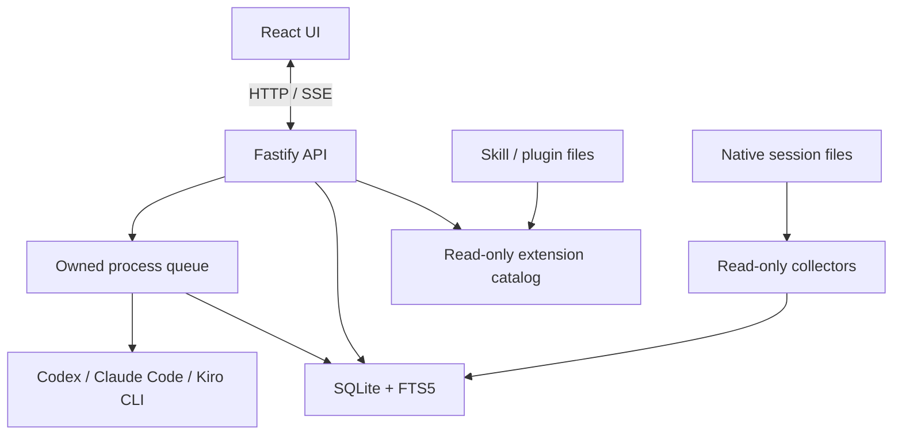

# Architecture

<a href="#english">English</a> · <a href="#korean">한국어</a>

## English

The CLI entrypoint (`server/index.ts`) acquires a data-directory lock and starts
the Fastify application (`server/app.ts`) on loopback. Fastify serves the built
React UI and API from one origin; SSE reports synchronization and run events.

Provider readers (`server/providers/index.ts`) normalize native history.
Synchronization (`server/sync.ts`) fingerprints sources and updates
SQLite (`server/store.ts`), including full-text indexes and user metadata.
Importing a session does not execute it.

The runner (`server/runner.ts`) schedules supported CLI processes using
validated arguments (`server/commands.ts`). It serializes work in the same
project, bounds runtime/output and cancels only owned processes. CLI credentials
remain with each installed CLI.

An authenticated proxy on the same machine can expose a configured HTTPS
subpath. Access checks (`server/access.ts`) validate local peers, Host and Origin;
UI URL resolution (`src/lib/urls.ts`) keeps API and SSE requests in that subpath.
The server continues to bind to `127.0.0.1`.

The extension catalog (`server/extensions/`) reads assistant configuration and
skill/plugin definitions on demand, separately from session import. It provides
bounded, redacted previews and static content analysis. Optional CLI analysis
uses the existing explicit run preview; catalog reads never launch a process.

See [operations](operations.md), [API contracts](api.md) and [design](design.md).

## 한국어

CLI 진입점(`server/index.ts`)이 데이터 디렉터리 잠금을 획득하고
Fastify 앱(`server/app.ts`)을 루프백에서 시작합니다. Fastify가 빌드된
React 화면과 API를 같은 출처에서 제공하며, SSE로 동기화와 실행 이벤트를
전달합니다.

수집기(`server/providers/index.ts`)는 원본 이력을 정규화합니다.
동기화(`server/sync.ts`)는 소스 지문을 비교해 본문 검색 색인과 사용자
메타데이터를 포함한 SQLite(`server/store.ts`)를 갱신합니다.
세션을 가져오는 동작은 에이전트를 실행하지 않습니다.

실행 관리자(`server/runner.ts`)는 검증한 인수(`server/commands.ts`)로
지원하는 CLI를 실행합니다. 같은 프로젝트의 작업은 순차 실행하고, 시간·출력
한도를 적용하며 소유한 프로세스만 취소합니다. 인증 정보는 각 CLI가 관리합니다.

같은 머신의 인증된 프록시는 명시한 HTTPS 하위 경로를 제공할 수 있습니다.
접근 검사(`server/access.ts`)는 로컬 연결·Host·Origin을 검증하고,
화면 URL 처리(`src/lib/urls.ts`)는 API와 SSE를 해당 경로 안에서 연결합니다.
서버는 계속 `127.0.0.1`에 바인딩합니다.

확장 목록(`server/extensions/`)은 세션 수집과 별도로 요청 시 어시스턴트 설정과
스킬·플러그인 정의를 읽습니다. 크기를 제한한 마스킹 미리보기와 로컬 내용
분석을 제공하며, 선택형 CLI 분석은 기존 실행 미리보기를 거칩니다.
목록을 조회하는 동작은 프로세스를 시작하지 않습니다.

[운영](operations.md), [API 계약](api.md), [설계](design.md)를 함께 참고하세요.
